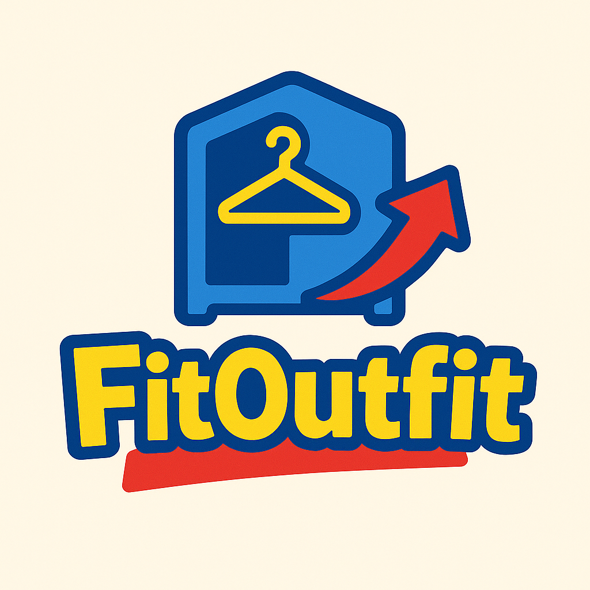

<h1 align="center">👔 FitOutfit 👗</h1>

<em>AI-powered fashion assistant to help you dress smarter, shop wiser, and express yourself authentically.</em>

---

## 📱 Tentang FitOutfit

FitOutfit adalah aplikasi fashion assistant berbasis AI yang membantu pengguna dalam memilih outfit yang sesuai dengan bentuk tubuh, tone kulit, serta jenis acara atau kegiatan tertentu. Dengan fitur personalisasi seperti Virtual Try-On, Wardrobe Assistant, dan rekomendasi fashion berdasarkan personal color, aplikasi ini bertujuan untuk mengedukasi pengguna tentang gaya pribadi mereka sekaligus mencegah impulsive buying. Melalui kerjasama dengan brand lokal, FitOutfit juga memberikan opsi belanja yang relevan dan efisien, sambil membantu pengguna tampil stylish tanpa harus over budget.

---

## 🎯 Tujuan Utama

Membantu pengguna:
- Menghindari belanja pakaian secara impulsif.
- Memahami gaya pribadi berdasarkan karakteristik pribadi.
- Memaksimalkan koleksi pakaian yang sudah dimiliki.

---

## 🚀 Fitur Utama

### 🧍‍♀️ Virtual Try-On  
Coba outfit secara virtual berdasarkan bentuk tubuh, skin tone, personal color, dan preferensi acara.

### 🧥 Wardrobe Assistant  
Unggah pakaian dan dapatkan ide mix & match otomatis untuk tampil maksimal dari isi lemari kamu.

### 🌍 Komunitas  
Bagikan style kamu, cari inspirasi outfit dari pengguna lain, dan jadi bagian dari komunitas fashion yang inklusif.

### 🕓 History  
Lacak riwayat outfit yang pernah digunakan agar tidak mengulang gaya yang sama atau bisa evaluasi gaya fashion kamu dari waktu ke waktu.

---

## 🌟 Visi

Menjadi **asisten fashion digital andal** yang:
- Memberi rekomendasi gaya personal berbasis AI.
- Mengedukasi pengguna tentang fashion yang sesuai diri.
- Mendorong budaya fashion yang **hemat**, **sadar**, dan **berkelanjutan**.

---

## 🛠️ Getting Started

Proyek ini dikembangkan menggunakan Flutter.

Beberapa referensi untuk kamu yang baru mulai:
- [Lab: Write your first Flutter app](https://docs.flutter.dev/get-started/codelab)
- [Cookbook: Useful Flutter samples](https://docs.flutter.dev/cookbook)
- [Flutter Documentation](https://docs.flutter.dev/)

---

  Made with ❤️ by FitOutfit Team

